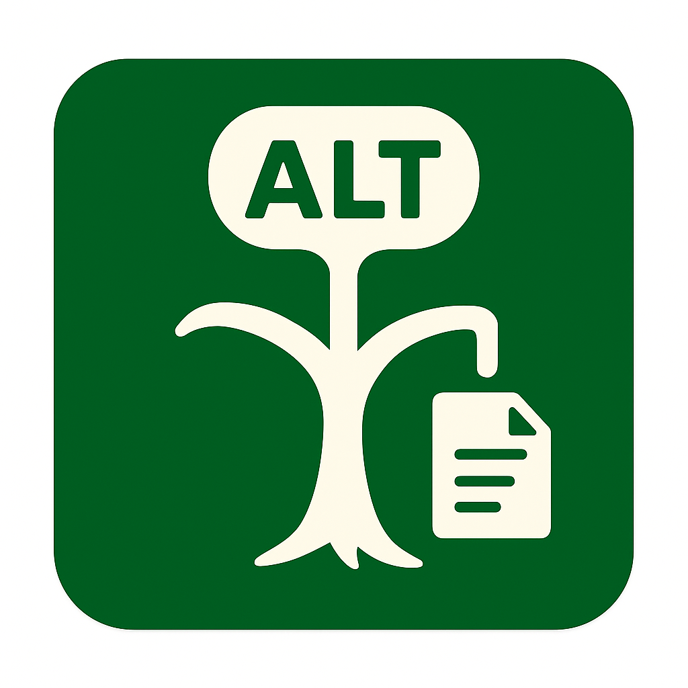

<p align="center">
  
</p>

<h1 align="center">ALT Decision Tree MCP Server</h1>

画像の代替テキスト（ALT属性）をALT決定木に基づいて自動生成するModel Context
Protocol (MCP) サーバーです。

## 機能

- **画像分析**: アップロードされた画像を分析し、内容を理解
- **ALT決定木**: W3C WAI-ARIAガイドラインに基づく代替テキスト決定プロセス
- **文脈考慮**: 画像の使用目的や文脈を考慮した適切な代替テキスト生成
- **信頼度スコア**: 生成された代替テキストの信頼度を数値で提供

## 使用方法

### サーバーの起動

```bash
deno run alt-decision-tree-mcp-server.ts
```

## MCP Tools

### generate_alt_text

画像から代替テキストを生成します。

**パラメータ:**

- `imageData` (必須):
  Base64エンコードされた画像データ（data:image/...;base64,... 形式）
- `context` (任意): 画像の文脈や用途に関する追加情報
- `imageFormat` (任意): 画像フォーマット（png, jpg, jpeg, gif, webp）

**戻り値:**

- `altText`: 生成された代替テキスト
- `reasoning`: 決定の理由
- `decision`: ALT決定木の各段階での判定結果
- `confidence`: 信頼度スコア（0-1）

### get_alt_guidance

ALT決定木のガイダンスと代替テキスト作成のベストプラクティスを提供します。

## ALT決定木のロジック

1. **装飾的かどうか**: 画像が装飾目的の場合、空の代替テキスト
2. **テキストを含むか**: 画像内のテキストを代替テキストとして使用
3. **複雑かどうか**: グラフや図表などは簡潔な説明と詳細説明
4. **情報的かどうか**: 画像の内容と目的を説明
5. **機能的な場合**: 画像の機能や目的を説明

## テスト

```bash
deno test
```

## 対応画像形式

- PNG
- JPEG/JPG
- GIF
- WebP

## ライセンス

MIT
